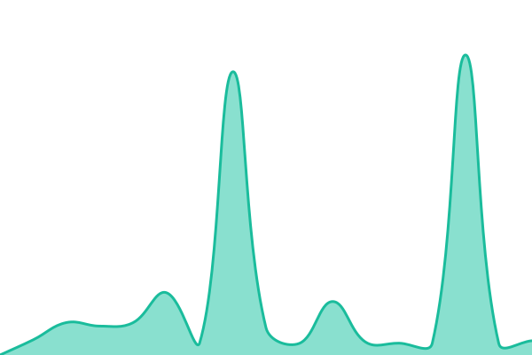

# [📈 Live Status](https://Rashnan.github.io/mnu-uptime): <!--live status--> **🟩 All systems operational**

This repository contains the open-source uptime monitor and status page for [RashDev](https://Rashnan.github.io/mnu-uptime), powered by [Upptime](https://github.com/upptime/upptime).

With [Upptime](https://upptime.js.org), you can get your own unlimited and free uptime monitor and status page, powered entirely by a GitHub repository. We use [Issues](https://github.com/Rashnan/mnu-uptime/issues) as incident reports, [Actions](https://github.com/Rashnan/mnu-uptime/actions) as uptime monitors, and [Pages](https://Rashnan.github.io/mnu-uptime) for the status page.

<!--start: status pages-->
<!-- This summary is generated by Upptime (https://github.com/upptime/upptime) -->
<!-- Do not edit this manually, your changes will be overwritten -->
<!-- prettier-ignore -->
| URL | Status | History | Response Time | Uptime |
| --- | ------ | ------- | ------------- | ------ |
|  [MNU](https://mnu.edu.mv) | 🟩 Up | [mnu.yml](https://github.com/Rashnan/mnu-uptime/commits/HEAD/history/mnu.yml) | 

 3640ms
     
 | 

<a href="https://Rashnan.github.io/mnu-uptime/history/mnu">100.00%</a>
    

|  [Moodle - Latest Term](https://moodle.mnu.edu.mv) | 🟩 Up | [moodle-latest-term.yml](https://github.com/Rashnan/mnu-uptime/commits/HEAD/history/moodle-latest-term.yml) | 

 2933ms
     
 | 

<a href="https://Rashnan.github.io/mnu-uptime/history/moodle-latest-term">100.00%</a>
    

|  [SelfService](https://selfservice.mnu.edu.mv/Default) | 🟩 Up | [self-service.yml](https://github.com/Rashnan/mnu-uptime/commits/HEAD/history/self-service.yml) | 

 2640ms
     
 | 

<a href="https://Rashnan.github.io/mnu-uptime/history/self-service">100.00%</a>
    

|  [Exam Portal](https://exam.mnu.edu.mv) | 🟩 Up | [exam-portal.yml](https://github.com/Rashnan/mnu-uptime/commits/HEAD/history/exam-portal.yml) | 

 5205ms
     
 | 

<a href="https://Rashnan.github.io/mnu-uptime/history/exam-portal">100.00%</a>
    

|  [MyMNU Portal - Existing Students Online Forms](https://my.mnu.edu.mv) | 🟩 Up | [my-mnu-portal-existing-students-online-forms.yml](https://github.com/Rashnan/mnu-uptime/commits/HEAD/history/my-mnu-portal-existing-students-online-forms.yml) | 

 3690ms
     
 | 

<a href="https://Rashnan.github.io/mnu-uptime/history/my-mnu-portal-existing-students-online-forms">100.00%</a>
    

|  [Courses](https://courses.mnu.edu.mv) | 🟩 Up | [courses.yml](https://github.com/Rashnan/mnu-uptime/commits/HEAD/history/courses.yml) | 

 1523ms
     
 | 

<a href="https://Rashnan.github.io/mnu-uptime/history/courses">99.53%</a>
    

|  [Application Portal - New Students Registration](https://portal.mnu.edu.mv) | 🟩 Up | [application-portal-new-students-registration.yml](https://github.com/Rashnan/mnu-uptime/commits/HEAD/history/application-portal-new-students-registration.yml) | 

 1913ms
     
 | 

<a href="https://Rashnan.github.io/mnu-uptime/history/application-portal-new-students-registration">100.00%</a>
    

|  [Helpdesk](https://helpdesk.mnu.edu.mv) | 🟩 Up | [helpdesk.yml](https://github.com/Rashnan/mnu-uptime/commits/HEAD/history/helpdesk.yml) | 

 1666ms
     
 | 

<a href="https://Rashnan.github.io/mnu-uptime/history/helpdesk">100.00%</a>
    

|  [Library OPAC](http://202.1.196.72:8080/sahara/opac/search/reset.do?SAMLResponse=&clientAlias=&time=&digest=&corporationAlias=mche) | 🟩 Up | [library-opac.yml](https://github.com/Rashnan/mnu-uptime/commits/HEAD/history/library-opac.yml) | 

 1051ms
     
 | 

<a href="https://Rashnan.github.io/mnu-uptime/history/library-opac">100.00%</a>
    

|  [Saruna](https://saruna.mnu.edu.mv/) | 🟩 Up | [saruna.yml](https://github.com/Rashnan/mnu-uptime/commits/HEAD/history/saruna.yml) | 

 3897ms
     
 | 

<a href="https://Rashnan.github.io/mnu-uptime/history/saruna">92.49%</a>
    

|  [Marathon](https://marathon.mnu.edu.mv) | 🟩 Up | [marathon.yml](https://github.com/Rashnan/mnu-uptime/commits/HEAD/history/marathon.yml) | 

 5254ms
     
 | 

<a href="https://Rashnan.github.io/mnu-uptime/history/marathon">34.81%</a>
    

<!--end: status pages-->

[**Visit our status website →**](https://Rashnan.github.io/mnu-uptime)

## 📄 License

- Powered by: [Upptime](https://github.com/upptime/upptime)
- Code: [MIT](./LICENSE) © [Anand Chowdhary](https://anandchowdhary.com), supported by [Pabio](https://pabio.com)
- Data in the `./history` directory: [Open Database License](https://opendatacommons.org/licenses/odbl/1-0/)
